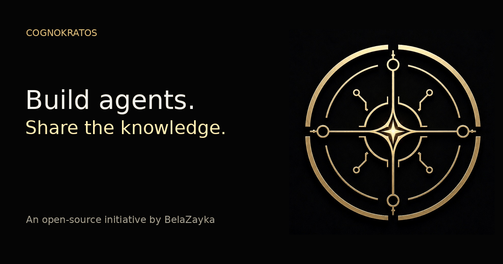

# CognoKratos

**Build agents. Share the knowledge.**

Runnable reference architectures for engineering increasingly consequential agentic systems: from production agent foundations, through runtime durability and governed decisions, to cryptographic capabilities and financial workflows. An open-source initiative by [BelaZayka](https://belazayka.com).



_Built to be understood. Designed to be extended. Shared to move us forward._

Written for experienced software engineers: working code, reproducible experiments and explicit trade-offs instead of demos. Across the portfolio, the model is treated as a probabilistic component. Where authority matters, it is enforced outside the model.

---

## Five engineering problems. Five runnable projects.

Each project is a working system with its own learning path, grounded in the code and explicit about what is implemented and what is planned.

### Production Agent Engineering · [`simple-agent-template`](https://github.com/cognokratos/simple-agent-template)

**How is a production agent engineered around an untrusted probabilistic component?**

Identity and trust boundaries through Keycloak and a Rust authentication gateway, MCP as a capability boundary, guardrails, opt-in signed human approvals, OpenTelemetry tracing and MLflow evaluation, and how to extend the reference architecture to your own domain. A learning path, concept pages, ten labs, a request walkthrough and challenges, all grounded in a customer-support example that is read-only by default.

`Rust` `Python` `NeMo Agent Toolkit` `MCP` `Keycloak` `PostgreSQL` · **Start:** [Learning path](https://github.com/cognokratos/simple-agent-template/blob/main/docs/LEARNING-PATH.md)

### Durable Agent Runtime Engineering · [`Σοφός Agent`](https://github.com/cognokratos/sophos-agent)

**Once you have an agent, how do you make it durable software that survives time, state, crashes and restarts?**

A small, local-first agent used to study runtime ownership: conversations vs threads vs runs vs checkpoints, SQLite checkpointing, durability boundaries, streaming vs persistence, kinds of memory, crash and resume semantics, and why checkpointing does not make side effects exactly-once.

`TypeScript` `SvelteKit` `LangGraph.js` `SQLite` `MCP` `Ollama` · **Start:** [Runtime learning path](https://github.com/cognokratos/sophos-agent/blob/main/docs/RUNTIME-LEARNING-PATH.md)

> A single-agent system; it does not implement multi-agent orchestration. Approvals, guardrails and tracing are on its roadmap.

### Governed Decision Engineering · [`etf-research-agent`](https://github.com/cognokratos/etf-research-agent)

**How do you put deterministic policy, evidence and human authority around probabilistic reasoning?**

The model does not make the authoritative decision. A versioned Rust rules engine evaluates each fund against an investor profile; the model explains and proposes; a human confirms or overrides through a signed approval; every change lands in an append-only history recording the policy versions in force. Policy as data, uncertainty and missing data, evidence contracts, decision authority, policy-versioned audit and system-level evaluation. It builds on the `simple-agent-template` architecture rather than re-teaching it.

`Rust` `Python` `NeMo Agent Toolkit` `MCP` `PostgreSQL` · **Start:** [Applied learning path](https://github.com/cognokratos/etf-research-agent/blob/main/docs/APPLIED-LEARNING-PATH.md)

> Decision support on a dated data snapshot. No market feed, brokerage or trade execution.

### Cryptographic Capability Engineering · [`Άρκτος Wallet`](https://github.com/cognokratos/arktos-wallet)

**How can probabilistic software request cryptographic capabilities without becoming the custodian of cryptographic authority?**

**Give agents capabilities, never secrets.** A self-hosted MCP service through which agents create HD wallets and derive Bitcoin Taproot and Ethereum addresses (BIP39, BIP32, BIP86, BIP44). Key hierarchies and HKDF separation, encrypted secret storage, secret lifetimes and zeroization boundaries, least-capability tool design, out-of-band identity, operator custody and recovery.

`Rust` `Axum` `SQLCipher` `MCP` · **Start:** [Cryptographic capability learning path](https://github.com/cognokratos/arktos-wallet/blob/main/docs/CRYPTOGRAPHIC-CAPABILITY-LEARNING-PATH.md)

> Agents receive public capabilities only. No tool signs or broadcasts transactions, signs messages, or exports keys, seeds or recovery phrases, so agents have no authority to move value. The model never holds secret material, but whoever operates the instance holds the encryption keys: self-hosted by the wallet owner, there is no third-party custodian; operated for someone else, the operator has custody.

### Agentic Financial Workflow Engineering · [`Ταύρος Revenue`](https://github.com/cognokratos/tauros-revenue)

**How can agents do operational financial work while humans keep the authority?**

Declarative domain modelling with Ash: resources, actions and policies that are enforced identically for the LiveView UI, the JSON:API and AI tools over MCP. Humans and agents are distinct actors, and the domain, not the prompt, decides what an agent with a valid API key may do. Capability vs authority, non-human identity, financial intent, state machines, idempotency, audit and reconciliation.

`Elixir` `Phoenix` `Ash` `PostgreSQL` · **Start:** [Learning path](https://github.com/cognokratos/tauros-revenue/blob/main/docs/LEARNING-PATH.md)

> Implemented on Ash, with a 16-lesson course and exercises: humans and agents with API keys, customer ownership, payment destinations, immutable invoice revisions, a state machine, idempotency, exact-payload human approval, an application-level audit record and eight reviewed MCP tools through AshAI. Database-enforced audit, payments and reconciliation are on the [roadmap](https://github.com/cognokratos/tauros-revenue/blob/main/docs/ROADMAP.md).

---

## Choose where to start

| If you want to…                                          | Start with                                                                                                                                               |
| -------------------------------------------------------- | -------------------------------------------------------------------------------------------------------------------------------------------------------- |
| Follow one request across every trust boundary           | [Follow one request](https://github.com/cognokratos/simple-agent-template/blob/main/docs/tutorials/REQUEST-WALKTHROUGH.md) · `simple-agent-template`     |
| Adapt a production agent architecture to your domain     | [Extending the template](https://github.com/cognokratos/simple-agent-template/blob/main/docs/EXTENDING.md) · `simple-agent-template`                     |
| See what survives when the process dies mid-run          | [Run lifecycle walkthrough](https://github.com/cognokratos/sophos-agent/blob/main/docs/runtime/RUN-LIFECYCLE-WALKTHROUGH.md) · `sophos-agent`            |
| Trace one consequential decision from policy to audit    | [Follow one decision](https://github.com/cognokratos/etf-research-agent/blob/main/docs/applied/DECISION-WALKTHROUGH.md) · `etf-research-agent`           |
| See where a secret exists, for how long, and who sees it | [Secret lifecycle walkthrough](https://github.com/cognokratos/arktos-wallet/blob/main/docs/capability/SECRET-LIFECYCLE-WALKTHROUGH.md) · `arktos-wallet` |
| Understand why an agent's capability is not authority    | [AI capability is not authority](https://github.com/cognokratos/tauros-revenue/blob/main/docs/AI-AUTHORITY.md) · `tauros-revenue`                        |

---

## How the projects fit together

```text
                        Production Agent Engineering
                           simple-agent-template
                  how a production agent is built and bounded
                                     │
              ┌──────────────────────┴──────────────────────┐
              ▼                                             ▼
   Durable Runtime Engineering                 Governed Decision Engineering
          sophos-agent                               etf-research-agent
   how the agent survives time                 how its decisions are governed


   Agentic Financial Workflow Engineering      Cryptographic Capability Engineering
          tauros-revenue        ─ ─ planned ─ ─ ▶         arktos-wallet
   who may intend a payment, and why            who may exercise a key, and how
```

The projects are complementary, not a mandatory curriculum. `simple-agent-template` teaches the general production-agent architecture and is the natural foundation. Sophos goes deep on runtime durability and ownership; ETF Research on governing consequential decisions. Arktos isolates cryptographic capability boundaries, and Tauros explores business and financial domain authority. Sophos, ETF Research and Arktos link back to the lessons they depend on instead of re-teaching them, so you can start wherever your question is.

Different engineering questions justify different tools. Rust is used for several low-level security and protocol boundaries: gateways, MCP servers, deterministic rules and key handling. Python carries the agent framework in the NeMo projects, TypeScript and LangGraph.js keep the Sophos runtime small enough to read end to end, and Elixir with Ash expresses business authority declaratively at the domain layer, enforced the same way for every interface.

---

## From model reasoning to financial authority

An agent can call a tool. Letting increasingly autonomous software take part in a financial workflow is a different engineering problem: authority has to be separated, and each part held by the component that can be trusted with it.

```text
Model reasoning           interprets, explains, proposes          the agent projects
      ↓
Agent capability          bounded tools, never credentials        simple-agent-template · arktos-wallet
      ↓
Governed intent           deterministic policy and domain rules   etf-research-agent · tauros-revenue
      ↓
Human authority           signed approval, verified at mutation   etf-research-agent · simple-agent-template
      ↓
Cryptographic authority   keys held outside the model             arktos-wallet (no signing yet)
      ↓
Settlement                value moves and is reconciled           research direction
```

The question behind the whole initiative: **how can increasingly autonomous software participate in consequential financial workflows without giving probabilistic models uncontrolled authority?**

> **Tauros knows financial intent. Arktos knows cryptographic authority.**

Today they are deliberately separate. Tauros stores public wallet addresses only and never holds a key; Arktos derives addresses but does not sign or broadcast. An optional Tauros-to-Arktos adapter is on the Tauros roadmap. Signing, payments and onchain settlement remain future work.

---

## Research directions

Ideas beyond the five current projects. All are exploratory and none has been started; scope and order may change.

| Idea             | Direction                                      |
| ---------------- | ---------------------------------------------- |
| Αρχνος Analytics | Blockchain data pipelines and analytics.       |
| Λύκος Vault      | Smart-contract controls for trusted execution. |
| Νέος Node        | Controlled EVM deployment infrastructure.      |
| Έργος Platform   | Bring agents and onchain workflows together.   |

---

## Built in the open. Backed by BelaZayka.

CognoKratos is an open-source initiative by BelaZayka GmbH, an independent AI consultancy based in the Zürich region of Switzerland. It is where we share practical engineering in agentic AI and financial systems, and work out in the open what comes next.

Explore the code, open an issue or contribute. Each repository documents its own setup, limitations and licensing. If your team needs help applying these architectures, [BelaZayka](https://belazayka.com) brings the design and implementation experience.

[cognokratos.com](https://cognokratos.com) · [belazayka.com](https://belazayka.com)

<sub>_Cognitio / Kratos_ — the power of knowledge. Shared. Original code and documentation in each repository are MIT licensed; third-party material keeps its own terms, and logos and brand images are not covered. This profile text is MIT licensed; the header image is a brand asset.</sub>
