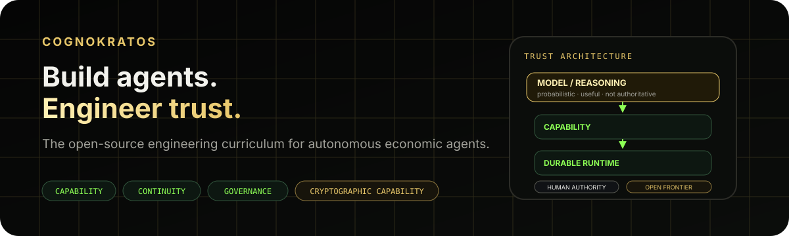

# CognoKratos

**Build agents. Engineer trust. Share the knowledge.**

CognoKratos is an **open-source, community-built engineering curriculum for the age of autonomous economic agents**.

AI agents are moving from systems that answer questions toward systems that act: invoking services, managing resources, proposing transactions and participating in economic workflows. CognoKratos explores the infrastructure required to give those systems meaningful capabilities **without surrendering security, verifiability or human control**.

> **The model is not the system.**
>
> Identity, authority, policy, durable state, audit, custody and settlement belong in explicit engineering boundaries around the model.

The curriculum is written for technically ambitious builders: hackers, cypherpunks, protocol and security engineers, distributed-systems engineers, AI infrastructure engineers and open-source contributors who want to understand what changes when autonomous software is given authority over real systems and economic resources.

[**Read the book**](https://book.cognokratos.com/) · [**Explore the curriculum**](../CURRICULUM.md) · [**Explore the ecosystem**](https://cognokratos.com/ecosystem/) · [**Read the foundation**](../FOUNDATION.md) · [**Contribute**](../CONTRIBUTING.md) · [**cognokratos.com**](https://www.cognokratos.com/)

---

## Learn the architecture. Then choose the implementation.

CognoKratos does not try to own every implementation layer. Agent frameworks, managed cloud platforms, governance toolkits, identity standards, wallet SDKs and payment or settlement infrastructure already exist for those jobs, and managed, open-source and self-built options can all be the right choice. CognoKratos is not another agent framework: it is a curriculum for understanding the trust boundaries between the frameworks, runtimes, policies, protocols and infrastructure you compose.

That is also why the laboratories use different languages and stacks. Each one teaches an engineering property rather than loyalty to a tool, so you can recognise that property in whichever implementation you choose.

> **The implementation may change. The engineering property should survive.**

[**Explore the ecosystem**](https://cognokratos.com/ecosystem/) to see where CognoKratos fits among frameworks, platforms, standards and infrastructure, and where to learn the fundamentals if you are new to agents.

---

## The current curriculum

The projects below are **the current state of the curriculum**, not its permanent definition. Each repository is a runnable laboratory built around one engineering question. The [CognoKratos Book](https://book.cognokratos.com/) connects them into a structured curriculum and compares their trust boundaries.

### I · Production Agent Engineering — [`simple-agent-template`](https://github.com/cognokratos/simple-agent-template)

**How is a production agent engineered around an untrusted probabilistic component?**

Agent loops, typed tools, MCP capability boundaries, grounding, guardrails, evaluation, observability, identity, trust boundaries and controlled state-changing actions.

> **Core lesson:** Intelligence does not imply authority.

The same architecture is built twice: on [`main`](https://github.com/cognokratos/simple-agent-template/tree/main) with NVIDIA NeMo Agent Toolkit, the canonical production reference, and on [`rust-agent`](https://github.com/cognokratos/simple-agent-template/tree/rust-agent) in Rust on Rig, a comparative learning implementation. Neither is presented as universally better; comparing them separates architectural properties from framework conveniences. *Can you still recognise the architecture after replacing the framework?*

[Learning path](https://github.com/cognokratos/simple-agent-template/blob/main/docs/LEARNING-PATH.md) · [Book, Part I](https://book.cognokratos.com/part-1/introduction.html) · [NAT and Rig compared](https://book.cognokratos.com/part-1/rig-rust.html)

### II · Durable Agent Runtime Engineering — [`Σοφός Agent`](https://github.com/cognokratos/sophos-agent)

**Once an agent can act, how does it become durable software that survives time, state, crashes and restarts?**

Runtime ownership, checkpoints, persistence, resume semantics, streaming, memory, replay, side effects and idempotency.

> **Core lesson:** Recoverable execution is not the same thing as exactly-once execution.

[Runtime learning path](https://github.com/cognokratos/sophos-agent/blob/main/docs/RUNTIME-LEARNING-PATH.md) · [Book, Part II](https://book.cognokratos.com/part-2/introduction.html)

### III · Governed Decision Engineering — [`etf-research-agent`](https://github.com/cognokratos/etf-research-agent)

**How do we place deterministic policy, evidence and human authority around probabilistic reasoning?**

Policy as code/data, evidence contracts, uncertainty, recommendation vs authority, signed human decisions, policy-versioned audit and system-level evaluation.

> **Core lesson:** The model can reason about a decision without owning the decision.

[Applied learning path](https://github.com/cognokratos/etf-research-agent/blob/main/docs/APPLIED-LEARNING-PATH.md) · [Book, Part III](https://book.cognokratos.com/part-3/introduction.html)

### IV · Cryptographic Capability Engineering — [`Άρκτος Wallet`](https://github.com/cognokratos/arktos-wallet)

**How can autonomous software request cryptographic capability without becoming the custodian of cryptographic authority?**

Key hierarchies, encrypted secret storage, deterministic derivation, secret lifetimes, identity-bound capabilities, least-capability tools and recovery.

> **Core lesson:** Give agents capabilities, never secrets.

Arktos currently derives public addresses only. It deliberately does **not** sign or broadcast transactions; secure signing remains part of the open research frontier.

[Cryptographic capability learning path](https://github.com/cognokratos/arktos-wallet/blob/main/docs/CRYPTOGRAPHIC-CAPABILITY-LEARNING-PATH.md) · [Book, Part IV](https://book.cognokratos.com/part-4/introduction.html)

### V · Agentic Financial Workflow Engineering — [`Ταύρος Revenue`](https://github.com/cognokratos/tauros-revenue)

**How can agents perform financial work while humans retain financial authority?**

Human and agent identity, domain authorization, immutable financial intent, state machines, idempotency, exact-payload approval, concurrency, reviewed MCP tool surfaces, audit and supervision.

> **Core lesson:** AI capability is not financial authority.

[Learning path](https://github.com/cognokratos/tauros-revenue/blob/main/docs/LEARNING-PATH.md) · [Book, Part V](https://book.cognokratos.com/part-5/introduction.html)

### VI · Connecting the Architectures — [The CognoKratos Book](https://book.cognokratos.com/part-6/introduction.html)

**Where does trust come from when these layers are composed?**

Part VI compares capability, permission and authority; runtime, domain and audit state; approval boundaries; replay and concurrency; and ends with an end-to-end design exercise for an agent-proposed payment.

> **Core lesson:** Trust comes from the composition of explicit boundaries, not from the model alone.

---

## Why cryptography and blockchain belong here

CognoKratos does **not** assume that every agent needs a blockchain.

Cryptography and decentralized infrastructure matter when they materially change the trust model: identity, signatures, custody, ownership, verifiable authorization, provenance, settlement, programmable constraints and coordination across organizational boundaries.

The objective is not "AI + blockchain" as a technology bundle. It is to understand which guarantees should come from deterministic software, which from people, which from cryptography, and where decentralized infrastructure can reduce unnecessary trust.

---

## A living curriculum

The current five laboratories are **Version 1**.

Open frontiers already include:

- secure signing and delegated cryptographic authority;
- settlement and reconciliation;
- portable agent identity and revocation;
- on-chain evidence and analytics;
- smart-contract authority and escrow;
- sovereign node infrastructure;
- multi-agent economic coordination;
- end-to-end autonomous economic systems.

The [curriculum map](../CURRICULUM.md) tracks what is taught today, what is only partially covered and which questions remain open.

A new track can grow from:

**research question → RFC/discussion → experiment → reference implementation → learning track → curriculum integration**

---

## Learn. Build. Challenge. Contribute.

CognoKratos is not intended to be a finished course produced by one author and consumed passively.

The highest-value contributions may be code, but they may also be:

- a reproducible failure that breaks an architectural assumption;
- a stronger threat model;
- an adversarial test;
- an alternative trust architecture;
- a new lab or case study;
- a missing curriculum competency;
- a new reference implementation;
- an entirely new curriculum track.

Reference architectures are propositions, not doctrine. If an implementation is wrong, incomplete or built on a weak assumption, the right contribution is to show it and help improve what the wider community can learn from it.

See [CONTRIBUTING.md](../CONTRIBUTING.md) for the contribution model.

---

## The CognoKratos model

**CognoKratos** is the living curriculum and community.

**The repositories** are the laboratories: runnable code, tests, experiments and explicit limitations.

**The book** is the textbook and synthesis layer: it connects the laboratories, explains why the boundaries exist and preserves pinned curriculum editions.

**The website** is the portal into the project.

**BelaZayka GmbH** is the founding sponsor and commercial engineering organization supporting the work. CognoKratos is designed to grow beyond its founders through community contribution.

---

## Built in the open

The current reference projects are educational architectures, not audited or certified products. They are deliberately explicit about implemented behaviour, limitations and future work.

The engineering challenges around autonomous economic agents are too consequential to hide entirely behind opaque systems. CognoKratos exists so engineers can inspect the boundaries, run the code, break the assumptions and share what they learn.

[**Read the book**](https://book.cognokratos.com/) · [**Foundation**](../FOUNDATION.md) · [**Curriculum**](../CURRICULUM.md) · [**Contributing**](../CONTRIBUTING.md) · [**BelaZayka**](https://belazayka.com)

Original CognoKratos code and documentation are released under the licences stated in each repository. Project brand assets retain their own terms.
